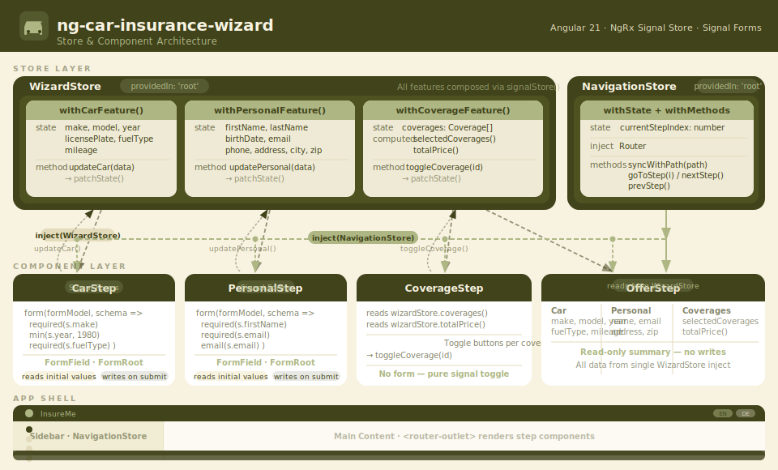

# ng-car-insurance-wizard



## Description

**ng-car-insurance-wizard** is a modern Angular application that guides users through a step-by-step process to enter vehicle details, personal information, and insurance coverages. The goal is to provide a simple, intuitive, and user-friendly experience for selecting and managing car insurance options.

## Architecture

The diagram above shows how the store and component layers interact:

- **WizardStore** (`providedIn: 'root'`) is composed from three `signalStoreFeature` functions:
  - `withCarFeature()` — car state + `updateCar()`
  - `withPersonalFeature()` — personal state + `updatePersonal()`
  - `withCoverageFeature()` — coverage list + `selectedCoverages()` + `totalPrice()` + `toggleCoverage()`
- **NavigationStore** injects Angular's `Router` and drives wizard navigation (`nextStep`, `prevStep`, `goToStep`)
- Each **step component** injects both stores. Steps that have forms use Angular **Signal Forms** (`form()`, `FormField`, `FormRoot`, validators)
- The **Sidebar** reads `currentStepIndex` from `NavigationStore` to highlight the active step
- The **OfferStep** reads all data from `WizardStore` in a single `inject()` call — no writes

## Project Structure

```
src/app/
├── config/
│   └── wizard.config.ts         # Step definitions (id, path, labelKey)
├── store/
│   ├── car.store.ts             # withCarFeature() — signalStoreFeature
│   ├── personal.store.ts        # withPersonalFeature() — signalStoreFeature
│   ├── coverage.store.ts        # withCoverageFeature() — signalStoreFeature
│   ├── navigation.store.ts      # NavigationStore — route + step management
│   └── wizard.store.ts          # WizardStore — composes all features
├── components/
│   ├── navbar/                  # Language switch (EN / DE) via ngx-translate
│   ├── sidebar/                 # Step progress, reads NavigationStore
│   └── footer/
└── steps/
    ├── car/                     # Signal Forms: required, min, max validators
    ├── personal/                # Signal Forms: required, email validators
    ├── coverage/                # Toggle buttons, reads/writes WizardStore
    └── offer/                   # Read-only summary from WizardStore
```

## Technologies Used

| Technology | Purpose |
|---|---|
| Angular v21 | Framework (standalone components) |
| NgRx Signal Store | State management via `signalStoreFeature` |
| Angular Signal Forms | `form()`, `FormField`, `FormRoot` from `@angular/forms/signals` |
| Tailwind CSS v4 | Styling with custom `@theme` color palette |
| ngx-translate | EN / DE internationalization |
| TypeScript 5.9 | Strict mode throughout |

## Color Palette

| Token | Hex | Usage |
|---|---|---|
| `w-dark` | `#41431B` | Header, buttons, store badges |
| `w-mid` | `#AEB784` | Accents, active states, icons |
| `w-light` | `#E3DBBB` | Borders, dividers |
| `w-pale` | `#F8F3E1` | Page background, card backgrounds |

## Getting Started

```bash
npm install
npm start        # http://localhost:4200
npm run build    # Production build
```
